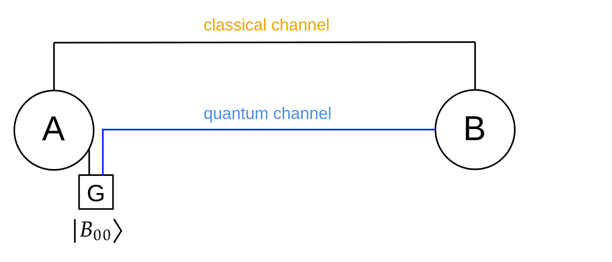

# Quantum Internet Hackathon 2022

```markdown
Hello, we are team #hackerita (a mix of *hack*thon and margh*erita* pizza), from Padua node.
This repo contains our code developed for QIH 2022.
```

<center>

</center>

<br>


### 1) A simple entangled state receiver

In this setup, Alice and Bob receive an entangled state $B_{00} = \frac{1}{\sqrt2}(|00\rangle+|11\rangle)$ and perform a measure. The measure is performed either in $\{|0\rangle,|1\rangle,\}$ or $\{|+\rangle,|-\rangle,\}$ basis, with 50% probability each.

Sifting is performed after a predefined number of shared qubits. Alice and Bob share each other the measure basis used, and they will discard the bits associated to not matching basis.

Even though this setup is utterly simple, it has been useful to take confidence in the use of [netsquid](https://netsquid.org/).

<br>


### 2) BBM92 protocol

Taking inspiration from the step 1 code, we implemented the **BBM92 protocol**. We associate an entangled source to Alice, which will send the (second) entangled qubit to Bob through a quantum channel.

<center>

</center>

<br>

However, we can change the network layout, so to include an eavesdropper in the quantum channel:

<center>

</center>

Either way, Alice and Bob perform measure in randomly choosen basis, storing the measure basis and the outcome. Eve works likewise, with an additional step to send an hijacked qubit to Bob, depending on the outcome of Eve's measure. Finally, sifting is performed sharing on the classical channel the chosen basis.

<center>

</center>